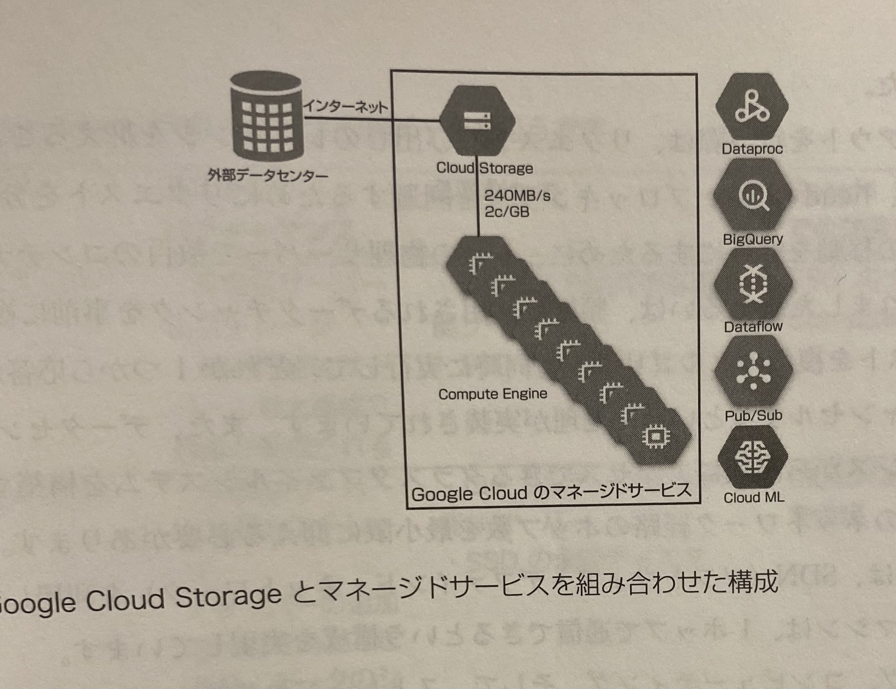
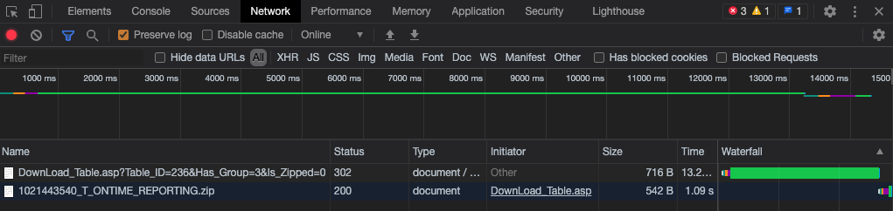
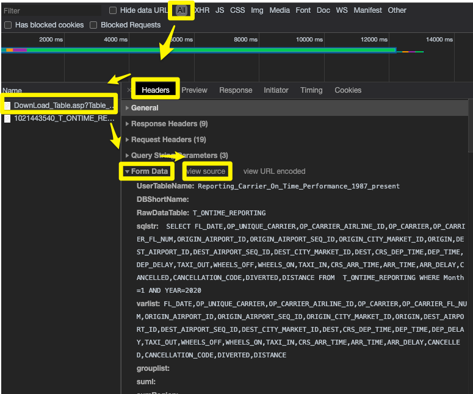
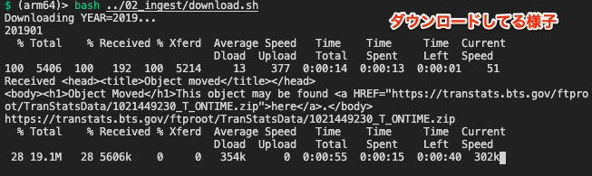
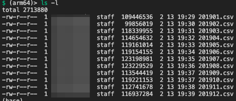
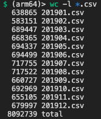
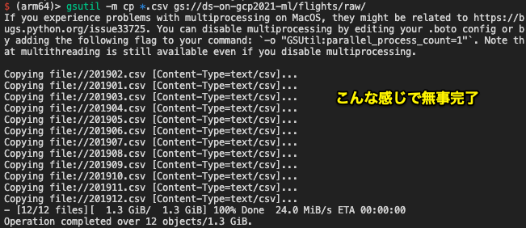
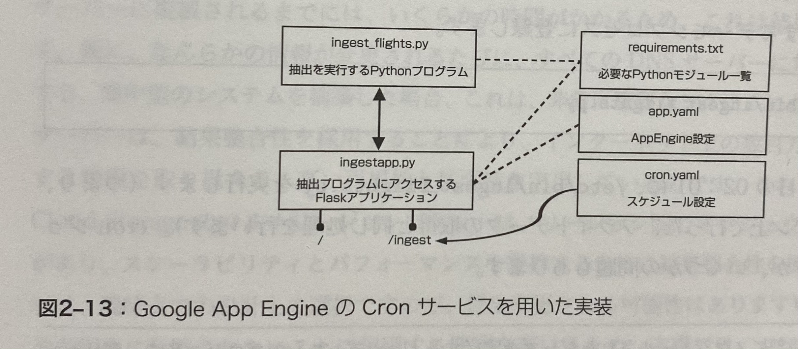

# 本章の概要

- 本書全般で扱うBTSの「オンタイムパフォーマンスデータ」の説明
- トレーニングとサービングの歪み
- 分析に用いるデータをクラウドストレージに保管する意義
- オンタイムパフォーマンスデータの探索とクレンジング
- データをクラウドストレージに保管する方法の解説
    - シェルスクリプトでローカルPCにダウンロード→gsutilでアップロード
    - Pythonでダウンロード
    - AppEngineで実行、cronで定期実行

## 予測時に知り得る情報を整理する

- BTSのデータにはいろいろ含まれているが、予測モデルを作るのに使える属性情報は一部である
- なぜなら、実際に予測するとき（今回であれば、飛行機が離陸する前）には「タクシーインの時間」や「実際の飛行距離」は使えない。したがって、学習時にもこれらのデータをつかうべきではない
- **因果律制約** という

## トレーニングとサービングの歪みに気をつける

- めちゃくちゃわかりやすい例：予測時はマイルを入力とするのに、学習時にキロメートルを使ってしまう行為
- もうちょっと現実的な例
  - 予測時に「直近５レコードの平均」を使う場合であれば、学習時も同様の計算にしなければならない
  - 仮に学習時に「平均」を使わずに、生データをそのままつかってしまうと、平均値よりもスパイクが大きく現れて、それを重要なシグナルとみなして学習してしまうかもしれない。単位を間違えるよりも大きな問題に繋がりうる

## ダウンロード元

- [BTS TranStats](https://www.transtats.bts.gov/DL_SelectFields.asp?Table_ID=236)
- このようなWebページからデータをとってくる
- 見た感じ、必要なデータセットのフィールド名を選択して、ダウンロードボタンを押す感じ
- これを自動化するには、スクレイピングが必要そうだ。


## 分析に用いるデータをクラウドストレージに保管する意義

- 以下の理由によりクラウドストレージに分析用データを保存することが望ましい。選択肢ごとのトレードオフを理解することが重要だ。
  - ローカルPCにすべてDLする場合
    - ストレージ利用コスト：HDD（4セント/GB）、SSD（20セント/GB）
    - ネットワーク速度：ー
    - **ただし、スケールしない**
  - 分析プログラムから必要な部分を適宜DLする
    - 単一情報源、セキュリティ保護OK
    - 古いデータを誤ってコピーしてしまうリスクが低い
    - ストレージ利用コスト：ゼロ
    - ネットワーク速度：一般的な速度（米国平均27MB/s）
      - ローカルでのディスクアクセス速度（X00MB/s）と比較して、ネットワーク速度がめちゃくちゃ遅いので、ボトルネックになる
  - 【おすすめ】データをDLしたあとパブリッククラウドにアップロードする。オリジナルのBTSとは別にデータ保管場所を作る
    - スケールアップ、スケールアウト可能。オンデマンドでコストを抑えられる
    - （豆知識）VMに接続されたローカルSSDと別途確保したSSDストレージだと、前者のほうがアクセス速度がだいぶ早いが、大規模のデータ分析タスクでは、全てをシーケンシャルに読み出す処理が中心となるため、ランダムアクセスの速度はあまり重要じゃなくて、一定のスループットを継続するほうが大事。なので、前者と後者は以外にも２倍程度の性能差になる。




## BTSのデータダウンロードを自動化する

### ダウンロードサイトをリバースエンジニアリング

- 一旦自分でみてみた
  - Webサイトの「Download」ボタンのHTML属性を見ると `<button type="Button" onclick="tryDownload()" class="tsbutton" name..>` という感じ
  - なので、`tryDownload()` 関数がどんな処理をするかを知ればいい？
  - いやそういうわけではないらしい。
- 本書には、「BTSのWebフォームは動的ではない、単純なHTMLのようです」と記載されている。疑問「動的な非単純なフォーム」がわからない。
- とはいえ、とりあえずここではどんなPOSTリクエストが送られているかがわかればいい（＝それをプログラムで再現すればいいから）とのことなので、そちらに専念しよう

---

- POSTリクエストの中身を見る手順
  - Chromeのデベロッパーツールを開く
  - Networkセクションを選択
  - `Preserve log` にチェックを入れる
  - 必要な項目にチェックをいれて実際にダウンロードしてみる
  - `All` を選択、`DownLoad...` のリクエストを選んで
  - `Headers` を選択、HTTPヘッダの中に `Form Data` があるので、そこの `view source` から完全なリクエストが見られる






- POSTリクエストの内容がわかったので、curlコマンドで実行してみよう
- `curl -X POST --data "コピペしたもの" http://www.transtats.bts.gov/DownLoad_Table.asp?Table_ID=236&Has_Group=3&Is_Zipped=0`
- 上記をコピペするだけだ（ちなみにコピーしたリクエストソース全部が↓↓）

```text
UserTableName=Reporting_Carrier_On_Time_Performance_1987_present&DBShortName=&RawDataTable=T_ONTIME_REPORTING&sqlstr=+SELECT+FL_DATE%2COP_UNIQUE_CARRIER%2COP_CARRIER_AIRLINE_ID%2COP_CARRIER%2COP_CARRIER_FL_NUM%2CORIGIN_AIRPORT_ID%2CORIGIN_AIRPORT_SEQ_ID%2CORIGIN_CITY_MARKET_ID%2CORIGIN%2CDEST_AIRPORT_ID%2CDEST_AIRPORT_SEQ_ID%2CDEST_CITY_MARKET_ID%2CDEST%2CCRS_DEP_TIME%2CDEP_TIME%2CDEP_DELAY%2CTAXI_OUT%2CWHEELS_OFF%2CWHEELS_ON%2CTAXI_IN%2CCRS_ARR_TIME%2CARR_TIME%2CARR_DELAY%2CCANCELLED%2CCANCELLATION_CODE%2CDIVERTED%2CDISTANCE+FROM++T_ONTIME_REPORTING+WHERE+Month+%3D1+AND+YEAR%3D2020&varlist=FL_DATE%2COP_UNIQUE_CARRIER%2COP_CARRIER_AIRLINE_ID%2COP_CARRIER%2COP_CARRIER_FL_NUM%2CORIGIN_AIRPORT_ID%2CORIGIN_AIRPORT_SEQ_ID%2CORIGIN_CITY_MARKET_ID%2CORIGIN%2CDEST_AIRPORT_ID%2CDEST_AIRPORT_SEQ_ID%2CDEST_CITY_MARKET_ID%2CDEST%2CCRS_DEP_TIME%2CDEP_TIME%2CDEP_DELAY%2CTAXI_OUT%2CWHEELS_OFF%2CWHEELS_ON%2CTAXI_IN%2CCRS_ARR_TIME%2CARR_TIME%2CARR_DELAY%2CCANCELLED%2CCANCELLATION_CODE%2CDIVERTED%2CDISTANCE&grouplist=&suml=&sumRegion=&filter1=title%3D&filter2=title%3D&geo=All%A0&time=January&timename=Month&GEOGRAPHY=All&XYEAR=2020&FREQUENCY=1&VarDesc=Year&VarType=Num&VarDesc=Quarter&VarType=Num&VarDesc=Month&VarType=Num&VarDesc=DayofMonth&VarType=Num&VarDesc=DayOfWeek&VarType=Num&VarName=FL_DATE&VarDesc=FlightDate&VarType=Char&VarName=OP_UNIQUE_CARRIER&VarDesc=Reporting_Airline&VarType=Char&VarName=OP_CARRIER_AIRLINE_ID&VarDesc=DOT_ID_Reporting_Airline&VarType=Num&VarName=OP_CARRIER&VarDesc=IATA_CODE_Reporting_Airline&VarType=Char&VarDesc=Tail_Number&VarType=Char&VarName=OP_CARRIER_FL_NUM&VarDesc=Flight_Number_Reporting_Airline&VarType=Char&VarName=ORIGIN_AIRPORT_ID&VarDesc=OriginAirportID&VarType=Num&VarName=ORIGIN_AIRPORT_SEQ_ID&VarDesc=OriginAirportSeqID&VarType=Num&VarName=ORIGIN_CITY_MARKET_ID&VarDesc=OriginCityMarketID&VarType=Num&VarName=ORIGIN&VarDesc=Origin&VarType=Char&VarDesc=OriginCityName&VarType=Char&VarDesc=OriginState&VarType=Char&VarDesc=OriginStateFips&VarType=Char&VarDesc=OriginStateName&VarType=Char&VarDesc=OriginWac&VarType=Num&VarName=DEST_AIRPORT_ID&VarDesc=DestAirportID&VarType=Num&VarName=DEST_AIRPORT_SEQ_ID&VarDesc=DestAirportSeqID&VarType=Num&VarName=DEST_CITY_MARKET_ID&VarDesc=DestCityMarketID&VarType=Num&VarName=DEST&VarDesc=Dest&VarType=Char&VarDesc=DestCityName&VarType=Char&VarDesc=DestState&VarType=Char&VarDesc=DestStateFips&VarType=Char&VarDesc=DestStateName&VarType=Char&VarDesc=DestWac&VarType=Num&VarName=CRS_DEP_TIME&VarDesc=CRSDepTime&VarType=Char&VarName=DEP_TIME&VarDesc=DepTime&VarType=Char&VarName=DEP_DELAY&VarDesc=DepDelay&VarType=Num&VarDesc=DepDelayMinutes&VarType=Num&VarDesc=DepDel15&VarType=Num&VarDesc=DepartureDelayGroups&VarType=Num&VarDesc=DepTimeBlk&VarType=Char&VarName=TAXI_OUT&VarDesc=TaxiOut&VarType=Num&VarName=WHEELS_OFF&VarDesc=WheelsOff&VarType=Char&VarName=WHEELS_ON&VarDesc=WheelsOn&VarType=Char&VarName=TAXI_IN&VarDesc=TaxiIn&VarType=Num&VarName=CRS_ARR_TIME&VarDesc=CRSArrTime&VarType=Char&VarName=ARR_TIME&VarDesc=ArrTime&VarType=Char&VarName=ARR_DELAY&VarDesc=ArrDelay&VarType=Num&VarDesc=ArrDelayMinutes&VarType=Num&VarDesc=ArrDel15&VarType=Num&VarDesc=ArrivalDelayGroups&VarType=Num&VarDesc=ArrTimeBlk&VarType=Char&VarName=CANCELLED&VarDesc=Cancelled&VarType=Num&VarName=CANCELLATION_CODE&VarDesc=CancellationCode&VarType=Char&VarName=DIVERTED&VarDesc=Diverted&VarType=Num&VarDesc=CRSElapsedTime&VarType=Num&VarDesc=ActualElapsedTime&VarType=Num&VarDesc=AirTime&VarType=Num&VarDesc=Flights&VarType=Num&VarName=DISTANCE&VarDesc=Distance&VarType=Num&VarDesc=DistanceGroup&VarType=Num&VarDesc=CarrierDelay&VarType=Num&VarDesc=WeatherDelay&VarType=Num&VarDesc=NASDelay&VarType=Num&VarDesc=SecurityDelay&VarType=Num&VarDesc=LateAircraftDelay&VarType=Num&VarDesc=FirstDepTime&VarType=Char&VarDesc=TotalAddGTime&VarType=Num&VarDesc=LongestAddGTime&VarType=Num&VarDesc=DivAirportLandings&VarType=Num&VarDesc=DivReachedDest&VarType=Num&VarDesc=DivActualElapsedTime&VarType=Num&VarDesc=DivArrDelay&VarType=Num&VarDesc=DivDistance&VarType=Num&VarDesc=Div1Airport&VarType=Char&VarDesc=Div1AirportID&VarType=Num&VarDesc=Div1AirportSeqID&VarType=Num&VarDesc=Div1WheelsOn&VarType=Char&VarDesc=Div1TotalGTime&VarType=Num&VarDesc=Div1LongestGTime&VarType=Num&VarDesc=Div1WheelsOff&VarType=Char&VarDesc=Div1TailNum&VarType=Char&VarDesc=Div2Airport&VarType=Char&VarDesc=Div2AirportID&VarType=Num&VarDesc=Div2AirportSeqID&VarType=Num&VarDesc=Div2WheelsOn&VarType=Char&VarDesc=Div2TotalGTime&VarType=Num&VarDesc=Div2LongestGTime&VarType=Num&VarDesc=Div2WheelsOff&VarType=Char&VarDesc=Div2TailNum&VarType=Char&VarDesc=Div3Airport&VarType=Char&VarDesc=Div3AirportID&VarType=Num&VarDesc=Div3AirportSeqID&VarType=Num&VarDesc=Div3WheelsOn&VarType=Char&VarDesc=Div3TotalGTime&VarType=Num&VarDesc=Div3LongestGTime&VarType=Num&VarDesc=Div3WheelsOff&VarType=Char&VarDesc=Div3TailNum&VarType=Char&VarDesc=Div4Airport&VarType=Char&VarDesc=Div4AirportID&VarType=Num&VarDesc=Div4AirportSeqID&VarType=Num&VarDesc=Div4WheelsOn&VarType=Char&VarDesc=Div4TotalGTime&VarType=Num&VarDesc=Div4LongestGTime&VarType=Num&VarDesc=Div4WheelsOff&VarType=Char&VarDesc=Div4TailNum&VarType=Char&VarDesc=Div5Airport&VarType=Char&VarDesc=Div5AirportID&VarType=Num&VarDesc=Div5AirportSeqID&VarType=Num&VarDesc=Div5WheelsOn&VarType=Char&VarDesc=Div5TotalGTime&VarType=Num&VarDesc=Div5LongestGTime&VarType=Num&VarDesc=Div5WheelsOff&VarType=Char&VarDesc=Div5TailNum&VarType=Char
```

- しかし、このままではzsipファイルへのリダイレクトしか得られない。ファイル自体は取得できないので、別のcurlコマンドを使うか、curlコマンドのオプションでリダイレクトに対応させなければならない。

---

### 実際に動作するダウンロードスクリプトの解説

データに関する試行錯誤は、Linuxのコマンドラインツールが便利である。

- curlをいい感じに使ったダウンロードスクリプト例は、`./download.sh` を参照
- 完全には理解してないけど、いろいろコメント書き込んでみた

とりあえず、以下の処理を実施することで、2019年の1年分のデータが取得できそう

```bash
cd data-science-on-gcp
mkdir data
cd data
bash ../02_ingest/download.sh
ls -lrt # ファイル詳細表示-l / 逆順表示-r / 更新時間順-t
```



次に、ダウンロードしたデータを一括でzip解凍して、適切な名前に変更する。上の続きで

```bash
bash ../02_ingest/zip_to_csv.sh
```



## BTSのデータを探索・クレンジングする

- `head -1 xxx.csv` コマンドでcsvの先頭1行を確認する
  - 最後の列あとに余分なカンマがある
- 以下のコマンドでデータが27項目ちゃんと入ってるか数える
  - `head -2 201901.csv | tail -1 | sed 's/,/ /g' | wc -w`
  - `head -2` で先頭2行取得
  - `tail -1` でそのうちの最終行＝2行目を取得
  - `sed 's/,/ /g'` でカンマをスペースに置換する
    - 's/{search}/{replace}/g' って感じの使い方らしい
  - `wc -w` でスペースで区切られたワード数をカウントしてる
  - ちなみに `sed` は stream editor の略らしい（[sed](http://gnuwin32.sourceforge.net/packages/sed.htm)）
  - ちなみに、`wc -w` でワードをカウント、`wc -l` で行数をカウントしてくれるみたい
- 以下のコマンドで各ファイルの行数を確認する
  - `wc -l *.csv`
  - 
- これにより、2019年のデータはトータルで800万行ぐらいあることがわかった


<br>

ちなみに上記コマンドの動きを確認するなら、こんなコマンドをうつといい

```bash
$ export AA=aaa,aaa,bbb

$ echo $AA
aaa,aaa,bbb

$echo $AA | sed 's/,/ /g'
aaa aaa bbb

echo $AA | sed 's/,/ /g' | wc -w
3
```

---

- 今回必要なクレンジング
  - 最終列のカンマを取り除く
  - 引用符を取り除く…のが一般的だけど今回は運良くその処理は必要なさそう
- 最終列のあとのカンマを取り除く処理は、最後にはPythonで処理するけど、一旦ここではシェルスクリプトでやっちゃう

```bash:quots_comma.sh
#!/bin/bash
echo ${YEAR:=2015}  # default if YEAR not set
for month in `seq -w 1 12`; do
    echo $YEAR$month.csv
    sed 's/,$//g' $YEAR$month.csv | sed 's/"//g' > tmp
    mv tmp $YEAR$month.csv
done
```

## Google Cloud Storage にデータをアップロード

とりあえず `macOS(x86_64)` のgcloud-sdk をインストールした

- プロジェクトID設定の注意
  - GCP世界全部でユニークでなくてはならない
- バケットを作る
  - センシティブな情報を名前に含めることは推奨しない
  - 通常は、`{project-ID}-ds32` みたいにする
  - 書籍では、コンソールでバケットを作ってたけど、ここでは `gsutil` を使う
  - `gsutil mb -l asia-northeast2 --retention 2m gs://ds-on-gcp2021-ml`
    - `-l asia-northeast2` で大阪リージョンを設定
    - `--retention 2m` で使用期間を2ヶ月に設定（なにもしなければ永遠）
    - `-c xxx` でストレージクラスも設定できるが、今回は何もしない。Standardで。
  - ちなみに、いきなり↑たたくと、支払い設定がなされてないアカウントだからだめって怒られた（`AccessDeniedException: 403 The project to be billed is associated with an absent billing account.`）
  - コンソールでやる場合でもそれは一緒。請求先の設定が必要。
- アップロードする
  - `gsutil -m cp *.csv gs://{bucket-name}/flights/raw/`
    - バケット内に `/flights/raw/` というフォルダがない場合は勝手に作ってくれる



<br>

- Cloud StorageはBlobストアなので、できるだけ複数ファイルは複数ファイルのまま、統合せずにアップロードすることを推奨する
  - なぜなら、追記ができない。したがって、もし次に追加ファイルをアップロードするとき、改めていろんな処理をしなきゃならない。無駄だし、「データをできるだけそのまま保管する」という目指す姿も実現できない。
- ファイルをアップロードするバケットはシングルリージョンを選択する
  - 理由１：今回はグローバルな可用性が必要ないから
  - 理由２：本書執筆時点では、GCPシングルリージョンバケットは強整合性（強い一貫性）を提供するが、マルチリージョンバケットはそうではないから。データ分析において、整合性は重要。
- **強整合性**とは？
  - 分散処理でいくつかのワーカーが動いていることをイメージして、
  - 各ワーカーが参照する値が常に一貫していることが担保されるのが強整合性
  - 一方で、一時的に整合ができない（ワーカーによって参照する値が異なる）が、後処理で調整するのが、**結果整合性**。
- 多くのプログラミングパラダイムでは、強整合性を暗黙の前提にしている
- 強整合性を担保するには、スケーラビリティとパフォーマンスを犠牲にする必要がある。（いわゆるCAP定理）

---

## 毎月のダウンロードをスケジュールする

- BTSの最新状態と本分析のデータレイクを同期させる
  - アプローチ１：BTSに新しいデータが発生したとき通知をうける
    - BTSは新着通知を提供していないので✗
  - アプローチ２：BTSのWebサイトを定期的にチェックして、新しいものがあれば取り込む
    - 採用
- 定番な手法
  - Unix/Linux の cron ジョブを利用する
  - `crontab` ファイルに `1 2 10 * * /etc/bin/ingest_flights.py` を追加して、スケジューリングを担当するデーモンプロセスに登録する
    - ちなみにこのコマンドは、「毎月10日の02:01に実行する」という意味
- cronジョブは簡単だが、いくつか問題がある（<font color=red>cron固有の課題ではなく、特定のサーバーに紐付けられた処理の課題</font>）
  - 問題１：cronジョブは特定のサーバーで実行される。ジョブ実行予定時刻に、そのサーバーが再起動されると、その月のデータがとれないことになる。
  - 問題２：今回の処理（DL, unzip, creansing）を実施できるコンピュータリソースがないといけない
  - 問題３：ジョブの失敗時にリトライ処理を実装できない。Pythonなどで実装する必要がある。
  - 問題４：ジョブの監視やワンショットでの実行は、cronの機能に含まれない。ジョブの監視を実装するには何らかの工夫が必要。
- では、クラウド上でこういった問題を解決するにはどうするか？
  - Compute Engine で cron ジョブ実行 → なにも解決していない。同じ状況
  - サーバーレスな手法 → 効率性と信頼性において○
    - 月に一度なので、ずっとサーバー管理したくない。定期実行したい。→ App Engine の cron サービスを使う
    - 最近ならば、CloudFunctions + CloudPub/Sub + Cloud Scheduler で実現できそう（[参考](https://qiita.com/tkykm/items/35a740f99e6dd52e0b75)）



<br>

- App Engine を使ったcron実行
  - 今回は一時的なファイルシステムが必要になるのでFlexible Environment を使う
  - Linuxのcronでは、cronデーモンが稼働するサーバー上の特定スクリプトを指定していたが、AppEngineの場合は、特定のURLを指定する。
  - したがって、「指定したタイミングに `xxx.com/ingest` にGETリクエストを投げる」みたいなことができるわけである。このURLで実行したいPythonスクリプトを呼び出すために、FlaskなどのWebアプリとしてラッピングしてやれば、所望のPythonスクリプトを実行できる


---

## Pythonによるダウンロード処理

これまで実装したBashスクリプトのままだとスパゲッティになる。もうちょっと本格的なプログラミング言語を使いましょう。

- 実装する機能
  - １：BTSのWebサイトからデータをダウンロードして、ローカルファイルに保存
  - ２：ダウンロードしたファイルをunzipして、CSVファイルを取り出す
  - ３：CSVファイルから引用符と末尾のカンマを削除する
  - ４：CSVファイルをCloud Storageにアップロードする
- 以降は、`./monthlyupdate/` で実装していく
- 実装のポイント
  - bashで動かす場合と違い、HTTPトリガーでオンデマンドで動かされるので、格納先ディレクトリの存在が絶対ではない。領域も十分かわからない。よって、Download関数の呼び出し元でディレクトリを作成しておいて、そのパスを引数にする。
  - 多分、細かいことはコードを読んだ方が早そうだ。
  - `tempfile` パッケージでテンポラリディレクトリを簡単につくれる（プレフィクスを指定して、あとにランダム文字をつけるパターンなので、同時に実行されても競合しない。便利！）
  - 失敗しうる処理は、基本try内で実施。
  - `ingest_flights.next_month()`
    - GCSに保存された最終ファイルの名称から、最後にアップロードした年月を割り出し、次に何年何月のデータを収集すればいいか返してくれる
    - コマンドライン引数で年か月を指定しなかった場合、バケット内のファイル名から自動で取得すべきデータを算出してくれる仕組み
- エラー処理
  - まだ利用できないデータは、BTSの場合「ヘッダのみ存在するCSV」が返される。これをvalidate関数で見つけ出して、例外を返すようにしている。
  - 有効な月を指定すると、クラウドストレージ上に新規作成（既存なら上書き）でファイルを作る
  - 存在しないバケットを指定するとキャッチされない例外が発生する
    - google.cloud pkg のExceptionにまかせているっぽい
  - AppEngineのCronサービスで例外が発生したときは、最大試行回数までリトライされる


## Flask webapp

- このアプリの役割は、Cronで上記 `ingest` 処理を実行するための橋渡し役みたいなもの
- URLは２つ
- 「/」：ただのWelcomeページ←作る必要ある？
- 「/ingest」：`ingest` 処理を呼び出す。終わったあとは、処理結果をHTMLとして（ほぼプレーンテキストだけど）表示するようにする。

---

- 本家のGitHubリポジトリを見る感じ、Flaskで作ってない。CloudFunctionsつかってるっぽいぞ。
- なにせ、Flaskアプリケーションを実行してるスクリプトもないし、AppEngineにデプロイするのに必須なapp.ymlもない。そして極めつけは、`monthlyupdate/deploy_cf.sh` である。CloudSDKのCloudFunctionsデプロイコマンド（`gcloud functions deploy`）をつかってる

## ~~App Engine で実行~~

## CloudFunctions で実行（最新版に対応）

- たぶん `deploy_cf.sh`
- デプロイスクリプトを読み解いて、何をしているのか理解する
  - `deploy_cf.sh`
    - `--entry-point ingest_flights` より、`ingest_flights()`をデプロイしている
    - Python3.7で実行
    - HTTPトリガーで実行
    - 認証なし実行を許可
    - タイムアウトは480秒
  - 実行したら「CloudBuildAPIを有効にしろ」と怒られた（`OperationError: code=7, message=Build failed: Cloud Build API has not been used in project ****** before or it is disabled. `）
    - CloudBuildAPIを有効にしたら、サービスアカウントとキーペアを作れと言われた。なので作っておいた。（サービスアカウント名は、devops@xxxx）
  - あと、一応デプロイ先のプロジェクトも明示的に記述しておいた（`gcloud --project` オプション）
  - あと、一応デプロイ先のリージョンをバケットと同じにしておいた。（`gcloud --region` オプション）
- 多分、deployしたときに生成される保護された関数名は保存しておいたほうが良い気がする


## URLの保護

- たぶん `generate_token.sh`
- `deploy_cf.sh` にもあるけど、opensslコマンドでランダム生成されたURLを生成している
- これにより、デプロイ先のURLを生成しているのだろう
- 一応コマンドの使い方を調べた
  - 参考：https://qiita.com/hana_shin/items/6d9de0847a06d8ee95cc
  - `openssl rand -base64 48 | tr -d /=+ | cut -c -32` を理解できればいい
    - `openssl rand -base64 12` で12文字のbase64エンコーディングランダム文字列が作れる
    - `tr` これはこの前出てきた。text replace. 文字列置換だ。
    - `cut -c -32` は末尾32文字の削除


## デプロイしたCloudFunctionsの実行方法

- たぶん `call_cf.sh`
- コマンドライン引数からデプロイ先のURL生成して、curlでPOSTしてるだけ、かな？
- コマンドライン引数には、リージョン、トークンなどを設定


## Cronタスクのスケジューリング

- たぶん `setup_cron.sh`
- CloudFunctionsのデプロイ先URLとバケットURLをコマンドライン引数から生成
- `gcloud beta scheduler jobs create http monthlyupdate` でジョブをスケジューリング
  - 参考：https://cloud.google.com/sdk/gcloud/reference/beta/scheduler/jobs
  - Cloud Scheduler jobs の管理コマンドらしい
  - `http monthlyupdate` の部分がどういう意味7日、リファレンスを読んでもわからない。

