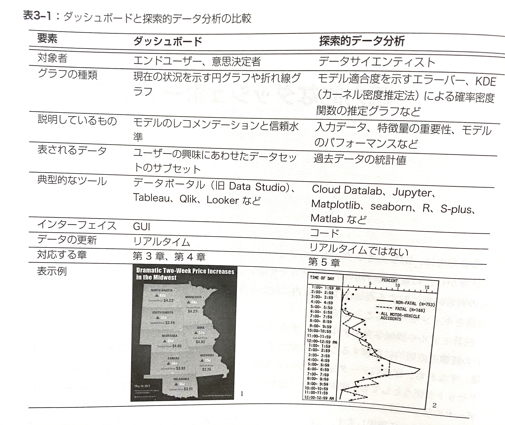
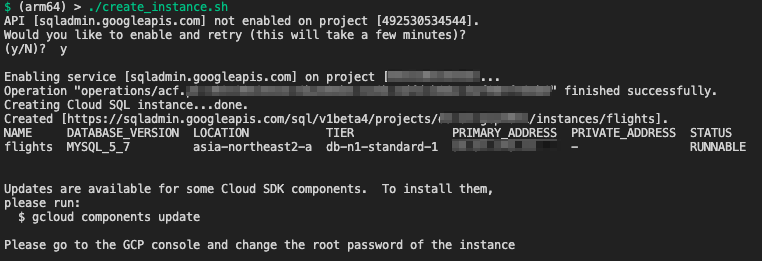

# 本章の概要

- データ理解に必要な作業として「探索的データ分析」と「ダッシュボード構築」がある
- 探索的データ分析は5章で扱う。本章はダッシュボード
- ダッシュボードは…
  - エンドユーザーや意思決定者を対象とした、対話的に操作可能なレポートである
  - データサイエンティストの為のものではない
  - 新たなモデルを開発するための知見を得ることが目的ではない
  - 既存のモデルの内容を説明することが目的である



---

<br>

## ダッシュボードでモデルを説明する

- ダッシュボードの目的は、「モデルがどのように機能しているかをユーザーに理解してもらうこと」である
- そのためには以下の３点に気をつける必要がある。
  - ①：データを正確に表現しているか（誤解を与える表現をしていないか）
  - ②：データそのものだけでなく、その背後にある情報を示すことができているか
    - ダッシュボードを対話的に操作して、ユーザー自身がデータに対する知見や洞察を得ようとするとき特に大事
  - ③：レコメンデーションの根拠となるモデルの振る舞いを十分に説明できるように構成されているか（<font color=red>★特に重要</font>）
- モデルの開発者は、モデルの全体的な評価をする一方で、エンドユーザーはより個別具体的なケースにおいて評価する。評価する粒度が違うのである。したがって、ダッシュボードを対話的に操作することで、そのユーザーが関心のある粒度でモデルを評価できるようにすることが望ましい。

---

<br>


## 最初にダッシュボードを作成する理由

- 目的１：モデル構築に役立つ情報をユーザーから提案してもらうため
  - 高性能なモデルを作るには、データセットの理解が必要。データサイエンティストは、もちろん包括的な視点にたってビジネス課題を分析課題に落とし込むわけだが、エンドユーザーの情報はその補完に役立つ。ダッシュボードとは、モデル構築に役立つアンケートのようなものである。
- 目的２：データが想像通りの内容かどうかは確認するため
  - データ理解のためには、EDAが欠かせないが、目的を明確にもつことが難しい。一方で、ダッシュボードを作るという明確で具体的な目的がもてると、作業が具体化されて良い。また、ユーザ向けに形をつくってくことで、自分自身の理解が促進される。ちょうど、物事を勉強するときにそれを誰かに教えることで、自身の理解もより一層深まるような感じだ。
- 目的３：モデルをリリースした後、ユーザーがモデルを利用する心理的障壁を下げる為
  - モデルをリリースする際は、その説明能力が「ユーザーが使ってくれるかどうか？」といった点において重要である。よくわからないものは使ってくれない。それを補うのがダッシュボードだ。さらに、ダッシュボードとモデルが一緒にリリースされていれば、ユーザーからさらなるアイデアが生まれやすくなる可能性もあり、一石二鳥である。使ってもらえるモデルにするためにダッシュボードが必要。


**その他の注意事項**

- ダッシュボードは、対象分野の専門家や将来のユーザーがよく目にするところに実装するのが良い
- 対象ユーザーや組織ごとに個別のダッシュボードを用意して、1つのツールに全ての情報を詰め込まないようにする

---

<br>


## 正確さ、信頼性、良いデザイン

- モデルに対して誤った解釈を誘導するような表示は避けよう。奇抜な手法は避けて、目的に応じた定番のビジュアライゼーションを選択しよう

<font color=pink>大きく4パターン</font>

- **相関**：2つの変数の関係性を示す
  - 折れ線グラフ、散布図
  - スケールの設定により誤解を与えないか、気をつける
- **時系列**：時間の経過に伴う値の変化を示す
  - 時間軸は水平方向に
  - メモリやラベルではなく、グラフのラインを強調すること
- **地図**：場所ごとの値の変化を示す
  - 関心のある領域を地図上で切り取り、データそのものを大きく表示
  - 地名などのテキストは目立たないように
- **説明的表現**：特定のストーリーを説明するためのレイアウト
  - デザイナー的能力が問われる分野

<br>

**勉強するにはプロの具体例を見るのが一番！**

- おすすめ：[Graphic Detail Blog | The Economist](https://www.economist.com/graphic-detail/)

---

<br>

## Google Cloud SQLにデータを読み込む

（本編：3.4~3.9までをまとめて記載）

- Cloud SQL で MySQL インスタンスを立ててやる理由
  - 今回扱うのが表形式データであるため、選択肢の一つとしてRDB
  - 小規模なデータセットに対して、不定形のクエリを実行する場合にRDBは適している
  - MySQL：幅広いユースケースをカバー、高性能、様々なライブラリが用意されていて、接続が用意
  - Cloud SQLがそもそもMySQLのマネージド・サービス（2021/02時点では、PostgreSQL/SQL Server もサポートされている）

Cloud SDK の Cloud SQL 系コマンド `gcloud sql` のリファレンスは[こちら](https://cloud.google.com/sdk/gcloud/reference/sql)

### Cloud SQL でインスタンスを立ち上げる

- `create_instance.sh` を参照
- `--activation-policy ALWAYS` に関する情報は[こちら](https://cloud.google.com/sql/docs/mysql/start-stop-restart-instance#gcloud)



<font color=grey>Note: bash上でCloudリソースに命令を出す時は、以下のような感じでgcloudコマンドでアクセストークンをとればいい。</font>

```bash
ACCESS_TOKEN="$(gcloud auth application-default print-access-token)"
curl --header "Authorization: Bearer ${ACCESS_TOKEN}" \
     --header 'Content-Type: aplication/json' \
     --data ...
```
って書いてたけど、以下のエラーが出るので、通常通りアクセスキーのJSONファイルのパスを環境変数 `GOOGLE_APPLICATION_CREDENTIALS` に設定して実行するべきか。

```bash
ERROR: (gcloud.auth.application-default.print-access-token) Could not automatically determine credentials. Please set GOOGLE_APPLICATION_CREDENTIALS or explicitly create credentials and re-run the application. For more information, please see https://cloud.google.com/docs/authentication/getting-started
```
